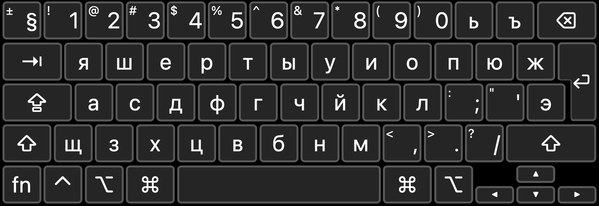
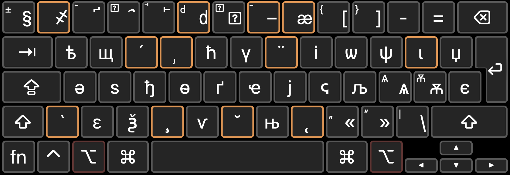

# Pan-Cyrillic keyboard for macOS
This is a keyboard layout for the Cyrillic script, inspired by the macOS built-in ABC (Extended) keyboard. 

## Installation
Copy both `Cyrillic.keylayout` and `Cyrillic.icns` (dark mode icon only) to `~/Library/Keyboard Layouts`. 

## Layout
### Bulgarian-based
#### Default layout
#### With `⌥ option` key pressed
To be added.

### Russian-based
#### Default layout

#### With `⌥ option` key pressed

