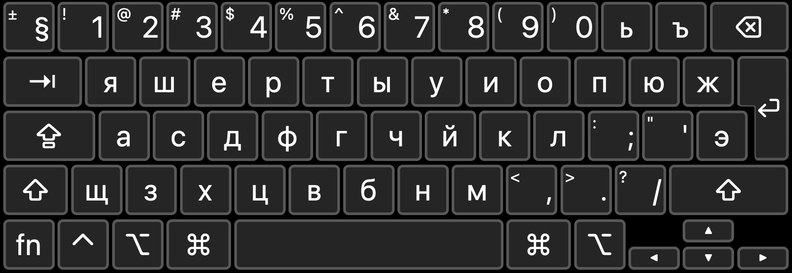
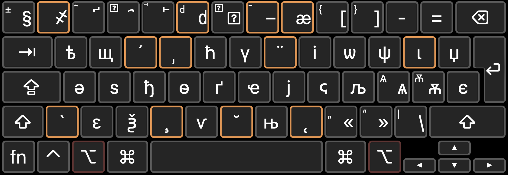

# Pan-Cyrillic keyboard for macOS
This is a keyboard layout for the Cyrillic script, inspired by the macOS built-in ABC (Extended) keyboard. 

## Base keyboards
You can choose between a QWERTY Bulgarian base or a QWERTY Russian base. 

## Installation
Copy both the `.keylayout` and `.icns` (dark mode icon only) files of the keyboard layout you want to `~/Library/Keyboard Layouts`, then restart your computer. 

## Layout
### Bulgarian-based
#### Default layout
#### With `⌥ option` key pressed
To be added.

### Russian-based
#### Default layout

#### With `⌥ option` key pressed

